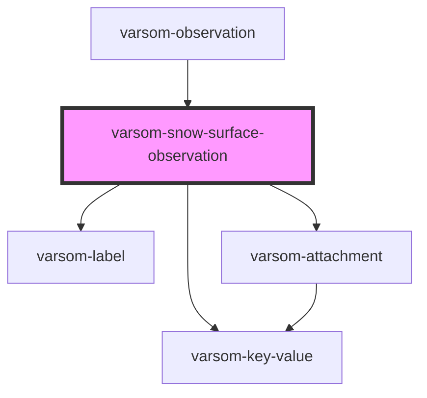

# varsom-snow-surface

<!-- Auto Generated Below -->

## Properties

| Property                  | Attribute                     | Description | Type           | Default     |
| ------------------------- | ----------------------------- | ----------- | -------------- | ----------- |
| `Attachments`             | --                            |             | `Attachment[]` | `undefined` |
| `Comment`                 | `comment`                     |             | `string`       | `undefined` |
| `FootPenetration`         | `foot-penetration`            |             | `number`       | `undefined` |
| `HeightLimitLayeredSnow`  | `height-limit-layered-snow`   |             | `number`       | `undefined` |
| `NewSnowDepth24`          | `new-snow-depth-2-4`          |             | `number`       | `undefined` |
| `NewSnowLine`             | `new-snow-line`               |             | `number`       | `undefined` |
| `SkiConditionsName`       | `ski-conditions-name`         |             | `string`       | `undefined` |
| `SkiConditionsTID`        | `ski-conditions-t-i-d`        |             | `number`       | `undefined` |
| `SnowDepth`               | `snow-depth`                  |             | `number`       | `undefined` |
| `SnowDriftName`           | `snow-drift-name`             |             | `string`       | `undefined` |
| `SnowDriftTID`            | `snow-drift-t-i-d`            |             | `number`       | `undefined` |
| `SnowLine`                | `snow-line`                   |             | `number`       | `undefined` |
| `SnowSurfaceName`         | `snow-surface-name`           |             | `string`       | `undefined` |
| `SnowSurfaceTID`          | `snow-surface-t-i-d`          |             | `number`       | `undefined` |
| `SurfaceRoughnessName`    | `surface-roughness-name`      |             | `string`       | `undefined` |
| `SurfaceWaterContentName` | `surface-water-content-name`  |             | `string`       | `undefined` |
| `SurfaceWaterContentTID`  | `surface-water-content-t-i-d` |             | `number`       | `undefined` |
| `shortVersion`            | `short-version`               |             | `string`       | `undefined` |

## Dependencies

### Used by

 - [varsom-observation](../varsom-observation)

### Depends on

- [varsom-label](../varsom-label)
- [varsom-key-value](../varsom-key-value)
- [varsom-attachment](../varsom-attachment)

### Graph

----------------------------------------------

*Built with [StencilJS](https://stenciljs.com/)*
