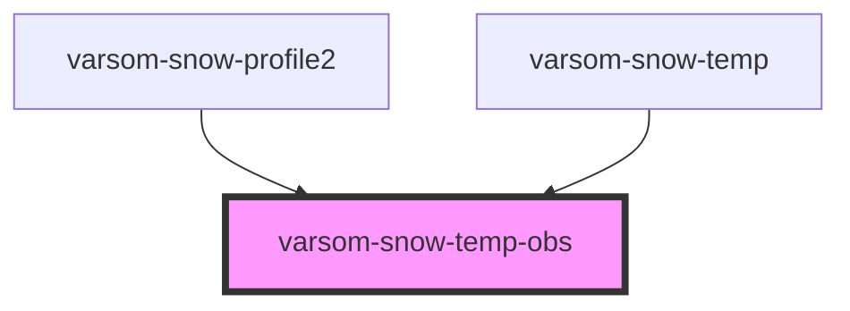

# varsom-metadata

<!-- Auto Generated Below -->

## Properties

| Property       | Attribute       | Description | Type  | Default     |
| -------------- | --------------- | ----------- | ----- | ----------- |
| `Depth`        | `depth`         |             | `any` | `undefined` |
| `SnowTemp`     | `snow-temp`     |             | `any` | `undefined` |
| `shortVersion` | `short-version` |             | `any` | `undefined` |

## Dependencies

### Used by

 - [varsom-snow-profile2](../varsom-snow-profile2)
 - [varsom-snow-temp](../varsom-snow-temp)

### Graph

----------------------------------------------

*Built with [StencilJS](https://stenciljs.com/)*
