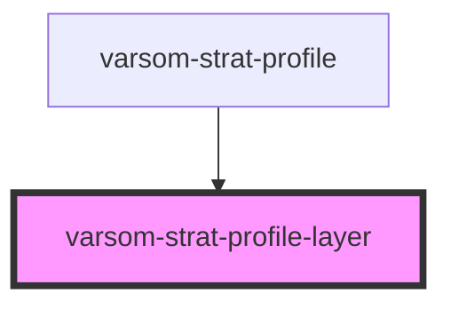

# varsom-snow-surface

<!-- Auto Generated Below -->

## Properties

| Property                  | Attribute                     | Description | Type     | Default     |
| ------------------------- | ----------------------------- | ----------- | -------- | ----------- |
| `Comment`                 | `comment`                     |             | `string` | `undefined` |
| `CriticalLayerTID`        | `critical-layer-t-i-d`        |             | `number` | `undefined` |
| `CriticalLayerTName`      | `critical-layer-t-name`       |             | `string` | `undefined` |
| `DepthTop`                | `depth-top`                   |             | `number` | `undefined` |
| `GrainFormPrimaryTID`     | `grain-form-primary-t-i-d`    |             | `number` | `undefined` |
| `GrainFormPrimaryTName`   | `grain-form-primary-t-name`   |             | `string` | `undefined` |
| `GrainFormSecondaryTID`   | `grain-form-secondary-t-i-d`  |             | `number` | `undefined` |
| `GrainFormSecondaryTName` | `grain-form-secondary-t-name` |             | `string` | `undefined` |
| `GrainSizeAvg`            | `grain-size-avg`              |             | `number` | `undefined` |
| `GrainSizeAvgMax`         | `grain-size-avg-max`          |             | `number` | `undefined` |
| `HardnessBottomTID`       | `hardness-bottom-t-i-d`       |             | `number` | `undefined` |
| `HardnessBottomTName`     | `hardness-bottom-t-name`      |             | `string` | `undefined` |
| `HardnessTID`             | `hardness-t-i-d`              |             | `number` | `undefined` |
| `HardnessTName`           | `hardness-t-name`             |             | `string` | `undefined` |
| `SortOrder`               | `sort-order`                  |             | `number` | `undefined` |
| `Thickness`               | `thickness`                   |             | `number` | `undefined` |
| `WetnessTID`              | `wetness-t-i-d`               |             | `number` | `undefined` |
| `WetnessTName`            | `wetness-t-name`              |             | `string` | `undefined` |
| `shortVersion`            | `short-version`               |             | `string` | `undefined` |

## Dependencies

### Used by

 - [varsom-strat-profile](../varsom-strat-profile)

### Graph

----------------------------------------------

*Built with [StencilJS](https://stenciljs.com/)*
