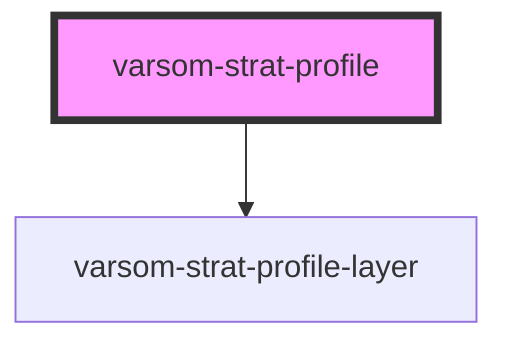

# varsom-snow-surface

<!-- Auto Generated Below -->

## Properties

| Property       | Attribute       | Description | Type                  | Default     |
| -------------- | --------------- | ----------- | --------------------- | ----------- |
| `Attachments`  | --              |             | `Attachment[]`        | `undefined` |
| `Layers`       | --              |             | `StratProfileLayer[]` | `undefined` |
| `TotalDepth`   | `total-depth`   |             | `any`                 | `undefined` |
| `shortVersion` | `short-version` |             | `any`                 | `undefined` |
| `strings`      | `strings`       |             | `any`                 | `undefined` |

## Dependencies

### Depends on

- [varsom-strat-profile-layer](../varsom-strat-profile-layer)

### Graph

---

_Built with [StencilJS](https://stenciljs.com/)_
