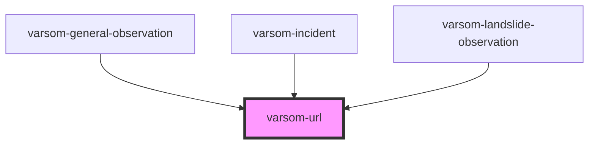

# varsom-snow-surface

<!-- Auto Generated Below -->

## Properties

| Property         | Attribute         | Description | Type  | Default     |
| ---------------- | ----------------- | ----------- | ----- | ----------- |
| `UrlDescription` | `url-description` |             | `any` | `undefined` |
| `UrlLine`        | `url-line`        |             | `any` | `undefined` |
| `strings`        | `strings`         |             | `any` | `undefined` |

## Dependencies

### Used by

 - [varsom-general-observation](../varsom-general-observation)
 - [varsom-incident](../varsom-incident)
 - [varsom-landslide-observation](../varsom-landslide-observation)

### Graph

----------------------------------------------

*Built with [StencilJS](https://stenciljs.com/)*
