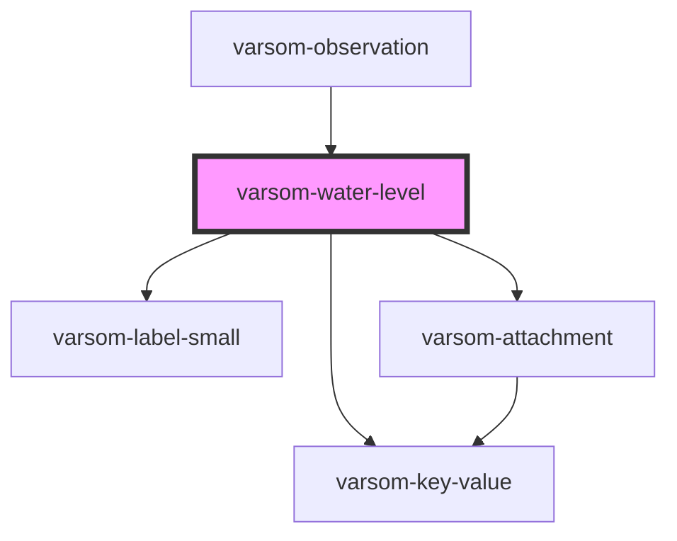

# varsom-water-level2

<!-- Auto Generated Below -->

## Properties

| Property              | Attribute               | Description | Type           | Default     |
| --------------------- | ----------------------- | ----------- | -------------- | ----------- |
| `Attachments`         | --                      |             | `Attachment[]` | `undefined` |
| `IsRiver`             | `is-river`              |             | `boolean`      | `undefined` |
| `MeasuredDischarge`   | `measured-discharge`    |             | `number`       | `undefined` |
| `WaterLevelDescribed` | `water-level-described` |             | `number`       | `undefined` |
| `WaterLevelRefName`   | `water-level-ref-name`  |             | `number`       | `undefined` |
| `WaterLevelRefTID`    | `water-level-ref-t-i-d` |             | `number`       | `undefined` |
| `WaterLevelValue`     | `water-level-value`     |             | `number`       | `undefined` |
| `shortVersion`        | `short-version`         |             | `string`       | `undefined` |

## Dependencies

### Used by

 - [varsom-observation](../varsom-observation)

### Depends on

- [varsom-label-small](../varsom-label-small)
- [varsom-key-value](../varsom-key-value)
- [varsom-attachment](../varsom-attachment)

### Graph

----------------------------------------------

*Built with [StencilJS](https://stenciljs.com/)*
