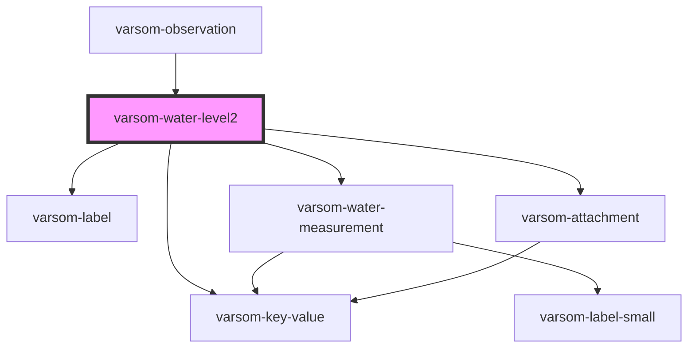

# varsom-water-level2

<!-- Auto Generated Below -->

## Properties

| Property                   | Attribute                     | Description | Type                      | Default     |
| -------------------------- | ----------------------------- | ----------- | ------------------------- | ----------- |
| `Attachments`              | --                            |             | `Attachment[]`            | `undefined` |
| `Comment`                  | `comment`                     |             | `string`                  | `undefined` |
| `MarkingReferenceName`     | `marking-reference-name`      |             | `string`                  | `undefined` |
| `MarkingReferenceTID`      | `marking-reference-t-i-d`     |             | `number`                  | `undefined` |
| `MarkingTypeName`          | `marking-type-name`           |             | `string`                  | `undefined` |
| `MarkingTypeTID`           | `marking-type-t-i-d`          |             | `number`                  | `undefined` |
| `MeasurementReferenceName` | `measurement-reference-name`  |             | `string`                  | `undefined` |
| `MeasurementReferenceTID`  | `measurement-reference-t-i-d` |             | `number`                  | `undefined` |
| `MeasurementTypeName`      | `measurement-type-name`       |             | `string`                  | `undefined` |
| `MeasurementTypeTID`       | `measurement-type-t-i-d`      |             | `number`                  | `undefined` |
| `MeasuringToolDescription` | `measuring-tool-description`  |             | `string`                  | `undefined` |
| `ObservationTimingName`    | `observation-timing-name`     |             | `string`                  | `undefined` |
| `ObservationTimingTID`     | `observation-timing-t-i-d`    |             | `number`                  | `undefined` |
| `WaterAstrayName`          | `water-astray-name`           |             | `string`                  | `undefined` |
| `WaterAstrayTID`           | `water-astray-t-i-d`          |             | `number`                  | `undefined` |
| `WaterLevelMeasurement`    | --                            |             | `WaterLevelMeasurement[]` | `undefined` |
| `WaterLevelMethodName`     | `water-level-method-name`     |             | `string`                  | `undefined` |
| `WaterLevelMethodTID`      | `water-level-method-t-i-d`    |             | `number`                  | `undefined` |
| `WaterLevelStateName`      | `water-level-state-name`      |             | `string`                  | `undefined` |
| `WaterLevelStateTID`       | `water-level-state-t-i-d`     |             | `number`                  | `undefined` |
| `shortVersion`             | `short-version`               |             | `string`                  | `undefined` |

## Dependencies

### Used by

 - [varsom-observation](../varsom-observation)

### Depends on

- [varsom-label](../varsom-label)
- [varsom-key-value](../varsom-key-value)
- [varsom-water-measurement](../varsom-water-measurement)
- [varsom-attachment](../varsom-attachment)

### Graph

----------------------------------------------

*Built with [StencilJS](https://stenciljs.com/)*
