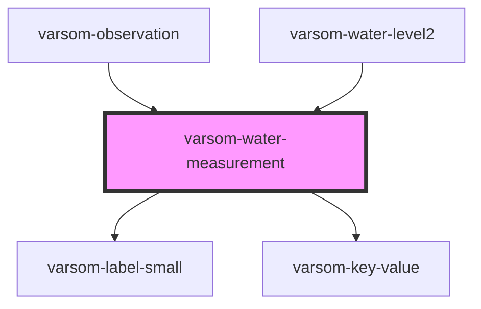

# varsom-water-measurement

<!-- Auto Generated Below -->

## Properties

| Property            | Attribute             | Description | Type     | Default     |
| ------------------- | --------------------- | ----------- | -------- | ----------- |
| `Comment`           | `comment`             |             | `string` | `undefined` |
| `DtMeasurementTime` | `dt-measurement-time` |             | `string` | `undefined` |
| `WaterLevelValue`   | `water-level-value`   |             | `number` | `undefined` |
| `shortVersion`      | `short-version`       |             | `string` | `undefined` |

## Dependencies

### Used by

 - [varsom-observation](../varsom-observation)
 - [varsom-water-level2](../varsom-water-level2)

### Depends on

- [varsom-label-small](../varsom-label-small)
- [varsom-key-value](../varsom-key-value)

### Graph

----------------------------------------------

*Built with [StencilJS](https://stenciljs.com/)*
