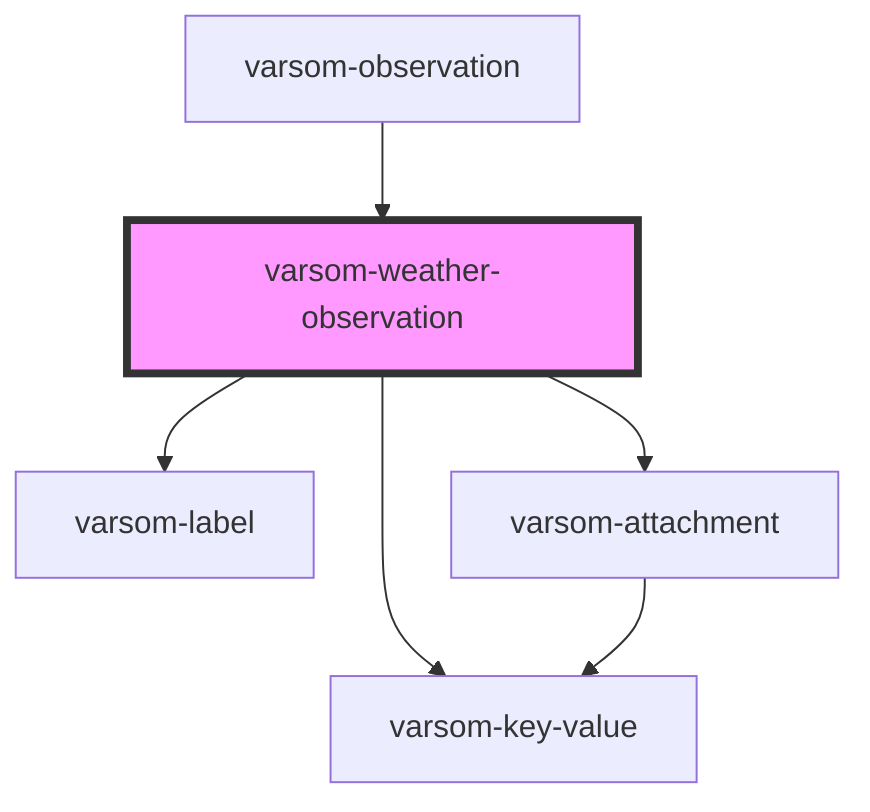

# varsom-weather

<!-- Auto Generated Below -->

## Properties

| Property            | Attribute             | Description | Type           | Default     |
| ------------------- | --------------------- | ----------- | -------------- | ----------- |
| `AirTemperature`    | `air-temperature`     |             | `number`       | `undefined` |
| `Attachments`       | --                    |             | `Attachment[]` | `undefined` |
| `CloudCover`        | `cloud-cover`         |             | `number`       | `undefined` |
| `Comment`           | `comment`             |             | `string`       | `undefined` |
| `PrecipitationName` | `precipitation-name`  |             | `string`       | `undefined` |
| `PrecipitationTID`  | `precipitation-t-i-d` |             | `number`       | `undefined` |
| `WindDirection`     | `wind-direction`      |             | `number`       | `undefined` |
| `WindDirectionName` | `wind-direction-name` |             | `string`       | `undefined` |
| `WindSpeed`         | `wind-speed`          |             | `number`       | `undefined` |
| `shortVersion`      | `short-version`       |             | `string`       | `undefined` |

## Dependencies

### Used by

 - [varsom-observation](../varsom-observation)

### Depends on

- [varsom-label](../varsom-label)
- [varsom-key-value](../varsom-key-value)
- [varsom-attachment](../varsom-attachment)

### Graph

----------------------------------------------

*Built with [StencilJS](https://stenciljs.com/)*
